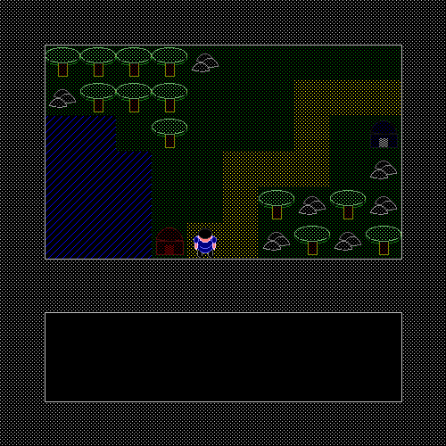
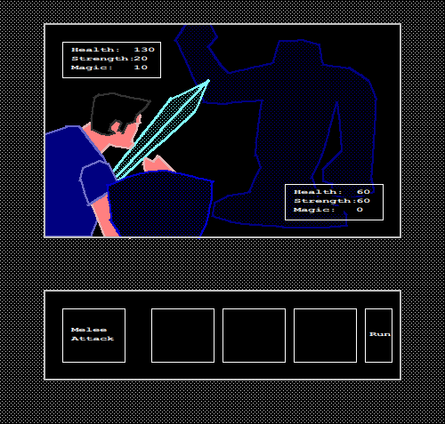
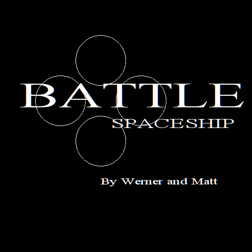
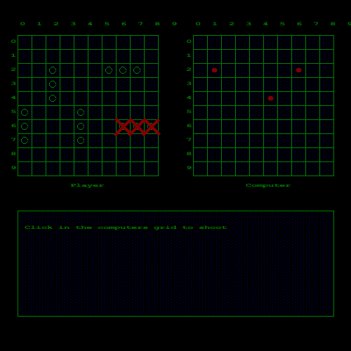
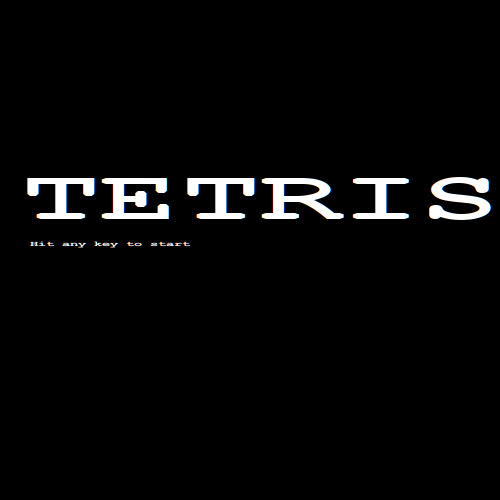
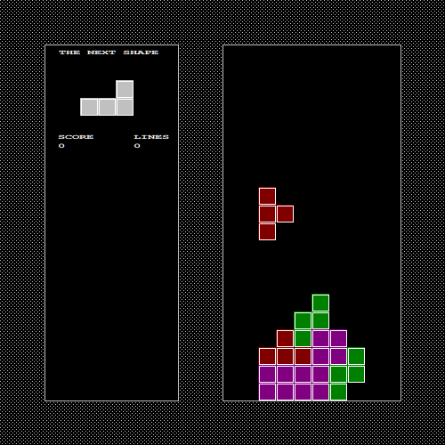

#windows-games

This project uses http://winbgim.codecutter.org/

Requires the following depenencies:

    sudo apt-get install make mingw-w64

To build the games:

    make

Optionally build using docker:

    alias make='docker-compose run --rm make'
    make

The compiled games can then be run in windows or using wine:

    wine 'battleship/Battle Spaceship.exe'
    wine celda/final.exe
    wine tetris/tetris.exe
